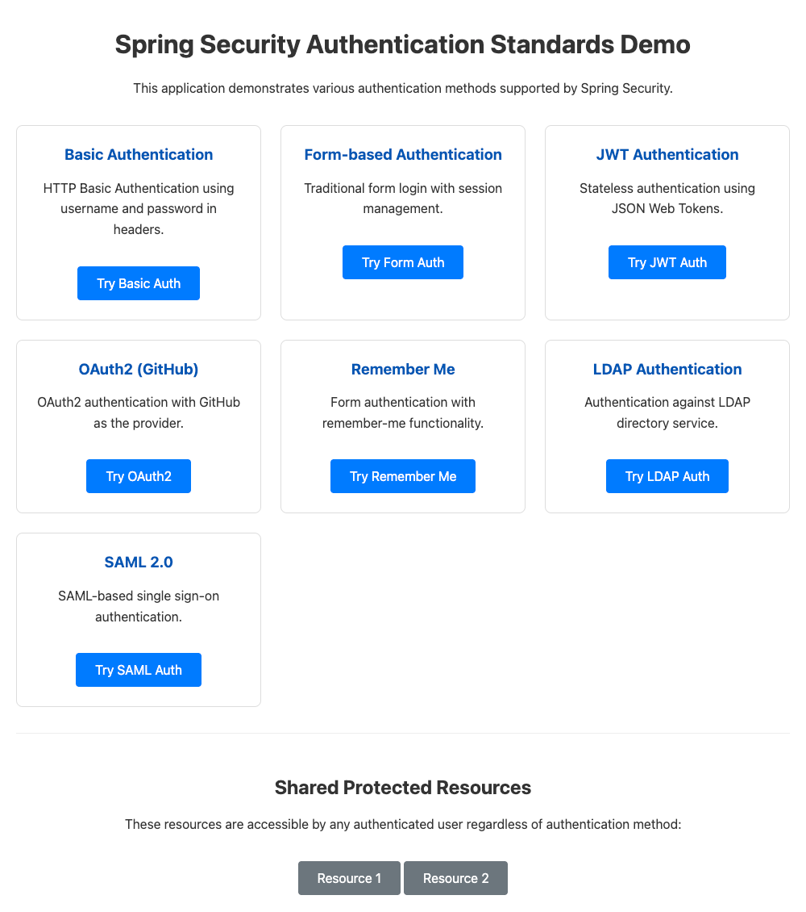

# Spring Security Authentication Demo

This project is a demonstration of various authentication mechanisms implemented using Spring Boot and Spring Security. Each authentication method is isolated into its own security filter chain and has its own set of UI pages.



## Features

This application showcases the following authentication methods:

-   **HTTP Basic Authentication:** Simple, stateless authentication using the `Authorization` header.
-   **Form-Based Authentication:** Traditional stateful authentication using an HTML form and server-side sessions.
-   **JWT (JSON Web Token) Authentication:** Stateless authentication using a bearer token, suitable for APIs and single-page applications.
-   **OAuth 2.0:** Delegated authentication using an external provider (GitHub).
-   **Remember-Me Authentication:** Persistent, cookie-based authentication that survives browser sessions.
-   **LDAP Authentication:** Authentication against an LDAP or Active Directory server.
-   **SAML 2.0:** Single Sign-On (SSO) with an external Identity Provider (IdP).

## Getting Started

### Prerequisites

-   Java 17 or later
-   Maven 3.6 or later
-   An LDAP server (for LDAP authentication)
-   A SAML Identity Provider (for SAML authentication)
-   A GitHub OAuth2 application (for OAuth2 authentication)

### Running the Application

1.  Clone the repository:
    ```bash
    git clone <repository-url>
    cd spring-authentication
    ```

2.  Build the project using Maven:
    ```bash
    mvn clean install
    ```

3.  Run the application:
    ```bash
    mvn spring-boot:run
    ```

The application will be available at `http://localhost:8081`.

## Authentication Methods

### 1. HTTP Basic Authentication

-   **URL:** `http://localhost:8081/basic/home`
-   **Username:** `user`
-   **Password:** `password`
-   **Testing:**
    ```bash
    curl -u user:password http://localhost:8081/basic/home
    ```

### 2. Form-Based Authentication

-   **URL:** `http://localhost:8081/form/login`
-   **Username:** `user`
-   **Password:** `password`

### 3. JWT (JSON Web Token) Authentication

-   **Login URL:** `http://localhost:8081/jwt/login`
-   **Credentials:** Use `user` and `password` to get a token.
-   **Accessing Protected Resources:** Include the token in the `Authorization` header as a bearer token.
    ```bash
    curl -H "Authorization: Bearer <your-jwt-token>" http://localhost:8081/jwt/home
    ```

### 4. OAuth 2.0

-   **Login URL:** `http://localhost:8081/oauth/login`
-   Click the "Login with GitHub" link to initiate the OAuth2 flow.
-   **Configuration:** You will need to configure your own GitHub OAuth2 application and update the `client-id` and `client-secret` in `src/main/resources/application.yml`.

### 5. Remember-Me Authentication

-   **Login URL:** `http://localhost:8081/remember/login`
-   **Username:** `user`
-   **Password:** `password`
-   Check the "Remember Me" box to enable persistent authentication.

### 6. LDAP Authentication

-   **Login URL:** `http://localhost:8081/ldap/login`
-   **Configuration:** Requires a running LDAP server. Configure the connection details in `src/main/resources/application.yml`.

### 7. SAML 2.0

-   **Home URL:** `http://localhost:8081/saml/home`
-   **Configuration:** This feature is currently disabled. To enable it, you must configure a SAML Identity Provider and provide a `RelyingPartyRegistrationRepository` bean in `SecurityConfig.java`.

## Shared Resources

The application includes shared resources that can be accessed after authenticating with any of the supported methods.
-   `http://localhost:8081/shared/resource1`
-   `http://localhost:8081/shared/resource2`
